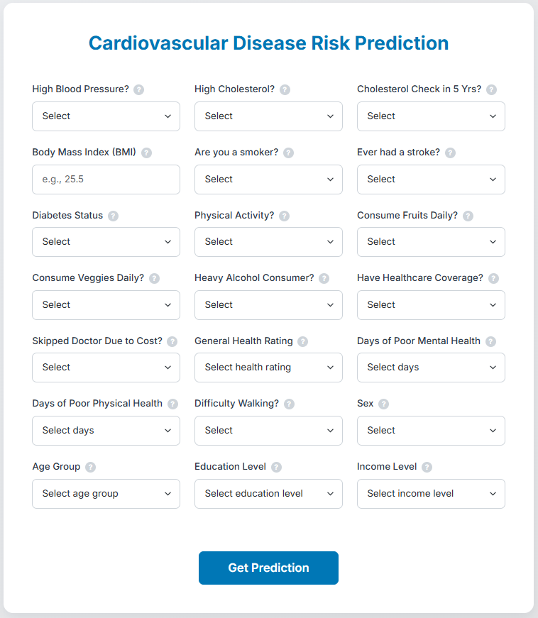

# Shravani Kairamkonda - Personal Portfolio


## 📄 Overview

Welcome to my personal portfolio website! This project showcases my journey as a **Data Analyst** and **Software Developer**, highlighting my skills, academic achievements, and featured projects. It is designed to be fully responsive, visually engaging, and easy to navigate.

**Live Demo:** [Click here to view the live site](https://shravani-kairamkonda-portfolio.netlify.app/)

## ✨ Features

-   **Responsive Design**: Seamless experience across Desktop, Tablet, and Mobile devices.
-   **Interactive UI**: Smooth animations, glassmorphism effects, and intuitive navigation.
-   **Dynamic Content**: Sections for About, Academics, Projects, Skills, and Resume.
-   **Project Showcases**: Detailed modals for key projects like *HeartSmart AI* and *Emotion Companion AI*.
-   **Contact Form**: Integrated form for easy communication.

## 🛠️ Tech Stack

-   **Frontend**: HTML5, CSS3, JavaScript (Vanilla)
-   **Styling**: Custom CSS with Flexbox/Grid, Animations, Google Fonts
-   **Icons**: FontAwesome / SVG Icons

## 📂 Project Structure

```bash
Portfolio/
├── index.html          # Main HTML structure
├── styles.css          # Core stylesheets and responsive design
├── script.js           # Interactive functionality (modals, mobile menu)
├── arrow-button-styles.css # Specific styles for arrow buttons
├── google_sites_embed.html # Embed component
├── profile.jpg         # Profile image
├── resume.pdf          # Downloadable resume
└── assets/             # Project images and resources
```

## 🎥 Demo Video

Check out a quick walkthrough of the portfolio functionality:


[](Portfolio-Demo.mp4)

*(Click the image above to play the demo video)*


## 🚀 Getting Started

To run this project locally:

1.  **Clone the repository**:
    ```bash
    git clone https://github.com/Shraa98/Portfolio.git
    ```
2.  **Navigate to the project directory**:
    ```bash
    cd Portfolio
    ```
3.  **Open `index.html`** in your preferred web browser.

## 📬 Contact

Feel free to reach out to me for collaboration or opportunities!

-   **Email**: [shravanikairamkonda@gmail.com](mailto:shravanikairamkonda@gmail.com)
-   **LinkedIn**: [Shravani Kairamkonda](https://www.linkedin.com/in/shravani-kairamkonda-65565521b/)
-   **GitHub**: [Shraa98](https://github.com/Shraa98)

---

&copy; 2024 Shravani Kairamkonda. All rights reserved.
